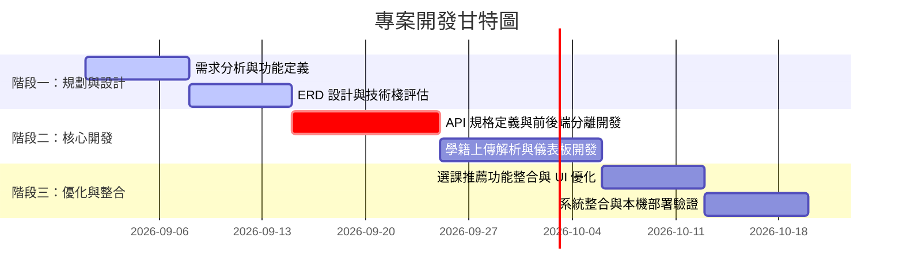

# 🎓 國立政治大學 資訊科學系 畢業學分驗證系統
(NCCU CS Graduation Credit Verification System)

本系統為 **國立政治大學「資料庫系統 (DBMS)」課程之期末專案**。旨在自動化解析與驗證學生的修課成績，並視覺化呈現畢業學分門檻達成進度，免除學生人工試算學分的繁瑣與延畢風險。

---

## 🎯 專案定位與痛點 (Product Positioning)

在大學部，畢業學分規則極其繁雜（包含專業必修、專業選修、通識大水庫、跨領域核心通識防呆等）。學生常因人工核對 Excel 發生失誤而導致遺漏學分被迫延畢。
* **產品定位**：一個為政大資科系學生量身打造的**「一鍵學分檢核與智慧選課推薦平台」**。
* **核心價值**：將複雜的教務處規章轉化為「視覺化儀表板」，並以「預警機制」與「個人化選課推薦」主動輔助學生規劃排課。

---

## 📋 產品經理 (PM) 實踐與排程分工

本專案由 8 人團隊共同開發（分為四組），我擔任 **產品經理 (PM) 兼前端 UI/UX 開發規劃** 角色，主導專案從零到一的產品定義、技術選型、時程規劃與組別分工。

### ⏳ 專案排程與階段規劃 (Timeline)
我們採用輕量敏捷開發，將 6 週的開發期劃分為三個主要階段：


* **階段一（W1~W2）：需求定義與架構設計**
  * 分析政大資科最新課規，繪製實體關係圖 (ERD)，定義資料表結構。
  * 評估技術棧，決定採用前後端分離架構。
* **階段二（W3~W4）：核心功能開發**
  * 制定 API 規格書，確保前後端並行開發不發生衝突。
  * 實作成績單上傳解析模組與前端視覺化儀表板。
* **階段三（W5~W6）：優化與整合**
  * 整合個人化選課推薦演算法。
  * 進行系統整合測試。

### 👥 團隊分工 (Team Roles)
本專案共 8 人參與，為了提升協作效率，我們將團隊細分為以下 **四個小組**：

* **1. 產品規劃與設計組 (PM & UI/UX Design) (由我主導)**
  * **我的 PM 職責**：負責產品定位、使用者痛點分析、功能範疇 (Scope) 定義與開發時程管理。主導跨組溝通，將複雜的政大畢業學分課規整理成結構化的「邏輯判斷樹」，協助後端組設計資料表結構。
  * **前端 UI/UX 設計與開發規劃**：主導產品的使用者路徑 (User Journey) 設計、畫面原型視覺化，並負責前端系統的架構整合與跨組聯調，協助前端組順利完成基於 React 18 + TypeScript + Tailwind CSS 的介面交付。
* **2. 前端開發組 (Frontend Engineering)**
  * 負責 React 18、TypeScript 與 Tailwind CSS 前端介面的功能開發、畫面元件實作與細節微調。
* **3. 後端與 API 開發組 (Backend & API)**
  * 負責使用 FastAPI (Python) 設計 RESTful API 路由，實作 SQLAlchemy ORM 與資料處理邏輯，確保前後端並行開發無縫對接。
* **4. 資料庫組 (Database)**
  * 負責設計資料表結構（Schema）並架設 SQLite/MySQL 資料庫，編寫核心學分解析演算法與課程推薦邏輯。

---

## 🌟 系統特色 (Features)

* **🎓 畢業門檻自動驗證**：精準計算「專業必修」、「專業選修」、「通識大水庫」等學分，自動對齊政大資科最新規範。
* **📊 視覺化儀表板 (Dashboard)**：以圓形進度條與直觀卡片呈現達成率，並針對核心通識跨領域規定提供防呆預警。
* **🤖 智慧選課推薦 (Course Recommendation)**：根據學生尚未滿足的畢業門檻與歷史修課紀錄，自動推薦合適課程。
* **📝 詳細規則清單 (Graduation Rules)**：條列式呈現具體缺少哪些必修課與學分，讓學生一目了然。

---

## 🚀 技術棧 (Tech Stack)

### 前端 (Frontend)
* **React 18 + Vite + TypeScript**：利用 React 的組件化加速 UI 開發；引進 TypeScript 強型別，在編譯期即抓出學分數據處理的潛在錯誤。
* **Tailwind CSS**：打造高質感、符合 RWD 的響應式介面，保證行動端與 PC 端的流暢體驗。
* **React Router DOM & Lucide React**：管理單頁應用 (SPA) 路由與提供現代化圖標。

### 後端 (Backend)
* **FastAPI (Python)**：高吞吐量、自動生成 OpenAPI 文件，極大提升前後端協作開發效率。
* **SQLite / MySQL & SQLAlchemy**：本機開發使用輕量 SQLite 以提升開發速度；生產環境相容 MySQL 資料庫。


## 🛠️ 本地快速執行指南 (Local Setup)

### 1. 後端啟動 (Backend)
```bash
cd dbms_final_backend
pip install -r requirements.txt
python seed.py # 初始化本地 SQLite 資料庫與預設規則
python -m uvicorn app.main:app --reload --port 8001
```
*後端將運行於 `http://localhost:8001`*

### 2. 前端啟動 (Frontend)
```bash
cd graduation-credit-verification-system
npm install
npm run dev
```
*前端將運行於 `http://localhost:3000`。預設測試學號：`111001001`，密碼：`password123`。*
