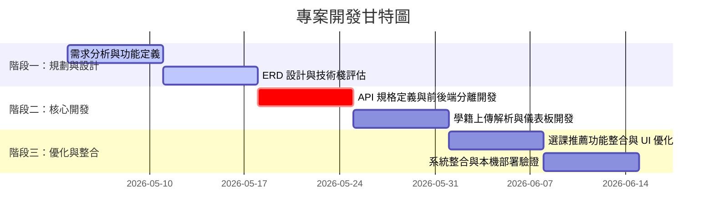

# 🎓 國立政治大學 資訊科學系 畢業學分驗證系統

(NCCU CS Graduation Credit Verification System)

本系統為 **國立政治大學「資料庫系統 (DBMS)」課程之期末專案**。旨在自動化解析與驗證學生的修課成績，並視覺化呈現畢業學分門檻達成進度，免除學生人工試算學分的繁瑣與延畢風險。

---

## 🔗 Demo

完整操作流程請見期末報告簡報中附的**系統操作展示影片**。若想實際操作，可依下方「本地快速執行指南」在本機啟動，測試帳號：`111001001` ／ 密碼 `password123`（另有 `111001002` ~ `111001004`）。

---

## 🎯 專案定位與痛點 (Product Positioning)

在大學部，畢業學分規則極其繁雜（包含專業必修、專業選修、通識大水庫、跨領域核心通識防呆等）。學生常因人工核對 Excel 發生失誤而導致遺漏學分被迫延畢。

- **產品定位**：一個為政大資科系學生量身打造的**「一鍵學分檢核與智慧選課推薦平台」**。
- **核心價值**：將複雜的教務處規章轉化為「視覺化儀表板」，並以「預警機制」與「個人化選課推薦」主動輔助學生規劃排課。

---

## 📋 產品經理 (PM) 實踐與排程分工

本專案由 8 人團隊共同開發（分為四組），我擔任 **產品經理 (PM) 兼前端 UI/UX 開發規劃** 角色，主導專案從零到一的產品定義、技術選型、時程規劃與組別分工。

### ⏳ 專案排程與階段規劃 (Timeline)

我們採用輕量敏捷開發，將 6 週的開發期劃分為三個主要階段：



- **階段一（W1~W2）：需求定義與架構設計**
  * 分析政大資科最新課規，繪製實體關係圖 (ERD)，定義資料表結構。
  * 評估技術棧，決定採用前後端分離架構。
- **階段二（W3~W4）：核心功能開發**
  * 制定 API 規格書，確保前後端並行開發不發生衝突。
  * 實作成績單上傳解析模組與前端視覺化儀表板。
- **階段三（W5~W6）：優化與整合**
  * 整合個人化選課推薦演算法。
  * 進行系統整合測試。

### 👥 團隊分工 (Team Roles)

本專案共 8 人參與，為了提升協作效率，我們將團隊細分為以下 **四個小組**：

- **1. 產品規劃與設計組 (PM & UI/UX Design) (由我主導)**
  * **我的 PM 職責**：負責產品定位、使用者痛點分析、功能範疇 (Scope) 定義與開發時程管理。主導跨組溝通，將複雜的政大畢業學分課規整理成結構化的「邏輯判斷樹」，協助後端組設計資料表結構。
  * **前端 UI/UX 設計與開發規劃**：主導產品的使用者路徑 (User Journey) 設計、畫面原型視覺化，並負責前端系統的架構整合與跨組聯調，協助前端組順利完成基於 React 18 + TypeScript + Tailwind CSS 的介面交付。
- **2. 前端開發組 (Frontend Engineering)**
  * 負責 React 18、TypeScript 與 Tailwind CSS 前端介面的功能開發、畫面元件實作與細節微調。
- **3. 後端與 API 開發組 (Backend & API)**
  * 負責使用 FastAPI (Python) 設計 RESTful API 路由，實作 SQLAlchemy ORM 與資料處理邏輯，確保前後端並行開發無縫對接。
- **4. 資料庫組 (Database)**
  * 負責設計資料表結構（Schema）並架設 SQLite/MySQL 資料庫，編寫核心學分解析演算法與課程推薦邏輯。

---

## 🌟 系統特色 (Features)

| 功能 | 對應頁面 / 元件 | 說明 |
|---|---|---|
| 登入 / 身份驗證 | `Login`（前端）、`auth_router`（後端，JWT） | 學號＋密碼登入，簽發 Token 後導向儀表板 |
| 學分儀表板 | `Dashboard`（前端）、`credit_check_router`（後端） | 以圓形進度條與卡片呈現「專業必修／專業選修／通識大水庫」等各類學分達成率 |
| 成績單上傳解析 | `EnrollmentUpload`（前端）、`student_course_record_router`（後端） | 上傳修課紀錄，解析後寫入學生修課紀錄資料表 |
| 畢業門檻檢核 | `GraduationCheck`（前端）、`graduation_rule_router`、`required_course_router`、`credit_check_router`（後端） | 比對畢業規則與必修清單，條列缺少的必修課與學分缺口，並針對跨領域核心通識提供防呆預警 |
| 課程查詢 | `CoursesQuery`（前端）、`course_router`、`course_category_router`、`course_category_mapping_router`（後端） | 查詢課程列表及所屬學分類別 |
| 智慧選課推薦 | `CourseRecommendation`（前端）、`recommendation_router`（後端） | 依尚未滿足的畢業門檻與歷史修課紀錄，自動推薦合適課程 |
| 全站側邊欄版面 | `SidebarLayout` | 登入後各頁面共用的導覽版面，未登入則導回 `/login` |

---

## 🗂️ 資料庫設計 (Database Design)

系統以 ERD 定義學生、課程、修課紀錄、學分類別與畢業規則之間的關聯，並依此設計 API 與檢核邏輯。

[](/eric6990kgy/graduation-credit-verification-system/blob/main/ERD.png)

---

## 🚀 技術棧 (Tech Stack)

### 前端 (Frontend)

- **React 18 + Vite + TypeScript**：利用 React 的組件化加速 UI 開發；引進 TypeScript 強型別，在編譯期即抓出學分數據處理的潛在錯誤。
- **Tailwind CSS**：打造高質感、符合 RWD 的響應式介面，保證行動端與 PC 端的流暢體驗。
- **React Router DOM & Lucide React**：管理單頁應用 (SPA) 路由與提供現代化圖標。

### 後端 (Backend)

- **FastAPI (Python)**：高吞吐量、自動生成 OpenAPI 文件，極大提升前後端協作開發效率。
- **SQLite / MySQL & SQLAlchemy**：本機開發使用輕量 SQLite 以提升開發速度；生產環境相容 MySQL 資料庫。

### 部署與維運 (Deployment & Ops)

- **Docker / Docker Compose**：前端（Nginx）、後端（FastAPI）、MySQL 三個容器化服務。
- **Python 壓力測試腳本**：驗證 API 與資料庫在多使用者並發下的效能表現。

---

## 📁 專案結構

```
.
├── graduation-credit-verification-system/   # 前端（React 18 + Vite + TypeScript）
│   └── src/
│       ├── pages/         # Login／Dashboard／EnrollmentUpload／CoursesQuery／GraduationCheck／CourseRecommendation
│       ├── layouts/       # SidebarLayout（全站側邊欄版面）
│       ├── services/      # api.ts（Axios API 封裝）
│       ├── mock/          # data.ts（展示用假資料）
│       ├── types/         # TypeScript 型別定義
│       └── App.tsx        # 路由設定（React Router，含登入保護）
│
├── dbms_final_backend/                       # 後端（FastAPI + SQLAlchemy）
│   └── app/
│       ├── routers/       # auth／student／course／course_category／course_category_mapping／
│       │                  # graduation_rule／required_course／credit_check／recommendation
│       ├── services/      # 商業邏輯層（學分檢核演算法、選課推薦邏輯等）
│       ├── repositories/  # 資料存取層（依 Model 對應的 CRUD）
│       ├── models/        # SQLAlchemy ORM 資料表定義
│       ├── schemas/       # Pydantic 請求／回應格式
│       ├── utils/         # auth（JWT）、統一回應格式
│       ├── database.py    # 資料庫連線設定
│       ├── config.py      # 環境設定
│       └── main.py        # FastAPI 進入點
│
├── scripts/                                  # 壓力測試等輔助腳本
├── 學校規定/                                  # 政大資科系課規原始文件
├── docker-compose.yml                        # 前端（Nginx）／後端（FastAPI）／MySQL 三容器編排
└── ERD.png                                   # 資料庫實體關係圖
```

---

## 🛠️ 本地快速執行指南 (Local Setup)

### 1. 後端啟動 (Backend)

```bash
cd dbms_final_backend
pip install -r requirements.txt
python seed.py # 初始化本地 SQLite 資料庫與預設規則
python -m uvicorn app.main:app --reload --port 8001
```

*後端將運行於 `http://localhost:8001`*

### 2. 前端啟動 (Frontend)

```bash
cd graduation-credit-verification-system
npm install
npm run dev
```

*前端將運行於 `http://localhost:3000`。預設測試學號：`111001001`，密碼：`password123`。*

### 3. 使用 Docker 一鍵啟動（前端＋後端＋資料庫）

```bash
cp .env.example .env   # 依需求填入 SECRET_KEY、MySQL 帳密
docker compose up -d --build
```

---

## 📄 延伸文件 (Additional Docs)

- [DEPLOYMENT.md](https://github.com/eric6990kgy/graduation-credit-verification-system/blob/main/DEPLOYMENT.md) — Docker 部署完整指南
- [LOAD_TEST.md](https://github.com/eric6990kgy/graduation-credit-verification-system/blob/main/LOAD_TEST.md) — API 壓力測試方法與結果解讀
